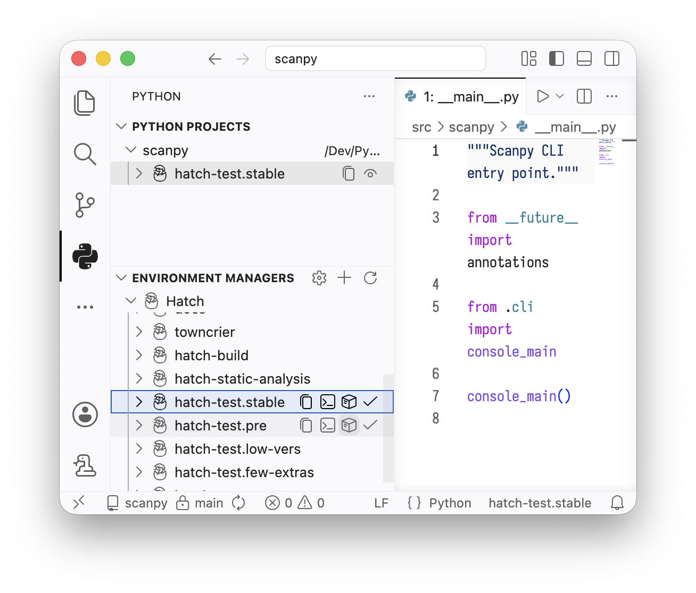

# Hatch Code
An extension to manage [Hatch environments] through [`vscode-python-environments`][].

To make use of it, make sure your user settings contain `"python.useEnvironmentsExtension": true`.

[hatch environments]: https://hatch.pypa.io/latest/tutorials/environment/basic-usage/
[`vscode-python-environments`]: https://github.com/microsoft/vscode-python-environments/#readme

## Features
- List all configured [Hatch environments]
- Provide controls to set them as active environment for your project, activate them in a terminal, and delete them from disk
- Temporarily modify an environment’s packages using the configured [`installer`]

Since many actions currently use `hatch run` and therefore sync the environment, temporary package changes can be quickly undone, especially removing packages installed as dependencies.
Persistent modifications to the installed packages should be done by editing Hatch’s `envs` configuration.

[`installer`]: https://hatch.pypa.io/latest/how-to/environment/select-installer/

## Extension Settings
- `hatch.executable`: path to the `hatch` executable (supports `~` expansion). Defaults to the output of `which hatch`.

## Limitations
- It’s pretty unclear which environments exist on disk and which don’t
- We list internal envs that users don’t usually interact with, such as `hatch-uv` and `hatch-build`
